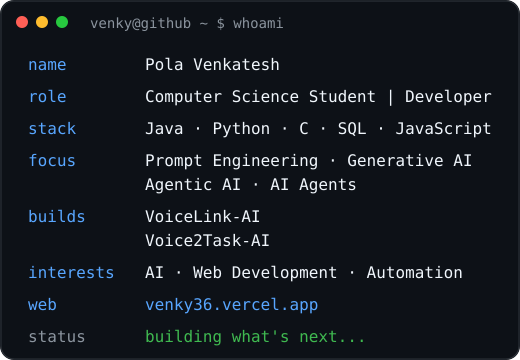
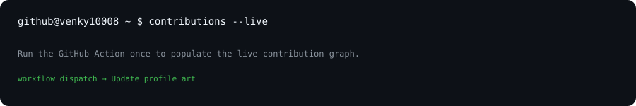

# `venky@github ~ $ whoami`

### Pola Venkatesh · Computer Science Student | Developer

 

  

### `venky@github ~ $ ./contributions.sh`

 

`venky@github ~ $ cat current_focus.txt`

**Prompt Engineering · Generative AI · Agentic AI · AI Agents**

`venky@github ~ $ ls projects/`

[**VoiceLink-AI**](https://github.com/Venky10008/Voicelink-ai) · [**Voice2Task-AI**](https://github.com/Venky10008/Voice2Task-AI)

`venky@github ~ $ cat stack.txt`

**Java · Python · C · SQL · JavaScript**

`venky@github ~ $ open portfolio`

[**venky36.vercel.app**](https://venky36.vercel.app)

`venky@github ~ $ interests`

**AI · Web Development · Automation**

